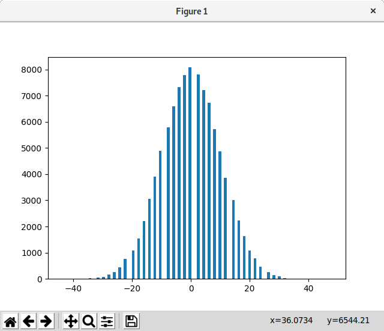
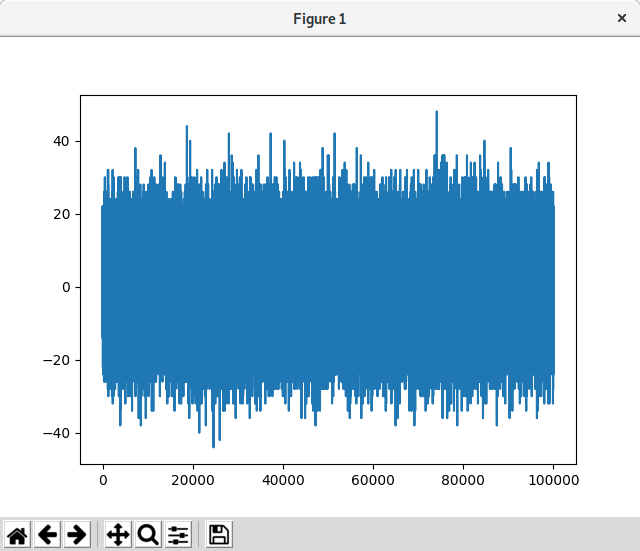

# Tossing coins

This is a small python script that simulates a coin-toss experiment.

## Install dependencies

You need [numpy](http://www.numpy.org/) to run the script.

### Using Pipenv

[Pipenv](https://pypi.org/project/pipenv/) is going to become the preferred way to install python libraries. First, clone this repo and cd into the directory

```
git clone https://github.com/ndicachi/tossing-coins
cd tossing-coins
pipenv install
pipenv shell
```

### Linux distros

Alternativelly you can install numpy in debian/PureOs/Ubuntu using `apt`.

```
apt install python3-numpy python3-tk
```

Or with fedora:

```
dnf install numpy
```

## Run the script

```
./tossing-coins.py
```

You will see two plots:







